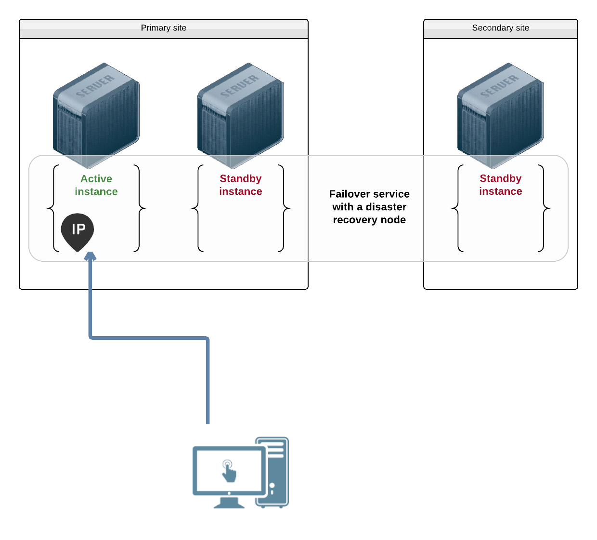

# Design Apps

Applications are composed of one or more objects (services, configs, secrets, volumes, service accounts).

The first design decision is the application split into different services. The main reasons for splitting are:

* Different lifecycle (volume vs svc)
* Different topologies (failover, flex)
* Security

## Topologies

The `topology` keyword decides how many nodes may run the object at once, and
is the choice that shapes everything else.

A `failover` object runs on one node at a time. The other nodes hold a standby
instance, ready to take over. A floating ip follows the active instance, so
clients keep reaching the service at the same address wherever it runs.

A `flex` object runs on several nodes at once, `flex_target` of them, within
the `[flex_min, flex_max]` range. Every instance is active and carries its own
ip, so a load balancer in front of them spreads the clients.

Pick `failover` for something only one node may own at a time, like a database
writing to a shared disk. Pick `flex` for something that scales by running more
copies, like a stateless web front end.

Configuration and secrets are objects too, installed into a service's storage
before it starts. See [Configs and Secrets](apps.design.datastores.md).

When the split is decided, each object must be named.

Each object configuration can be designed on a development cluster or namespace. These configurations can be tracked alongside the application code base.

Finally, the configurations can be deployed on test, up to production clusters or namespaces. Usually, these deployments are handled by a CI/CD pipeline.
